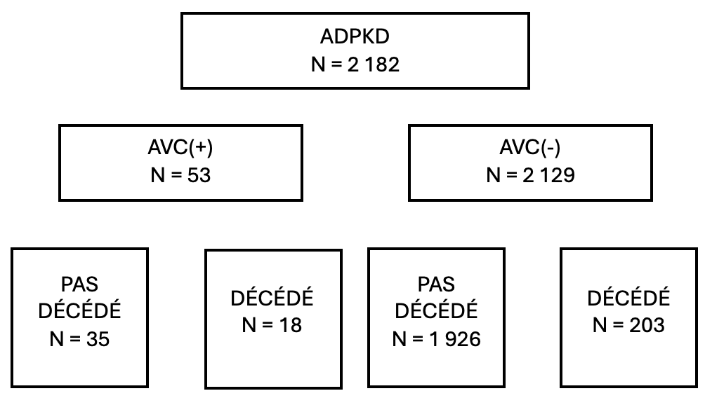
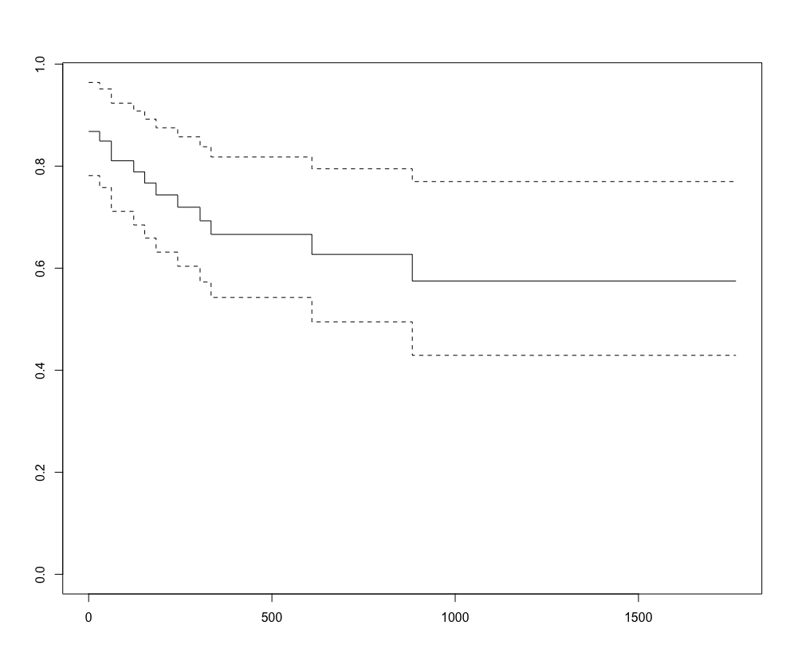
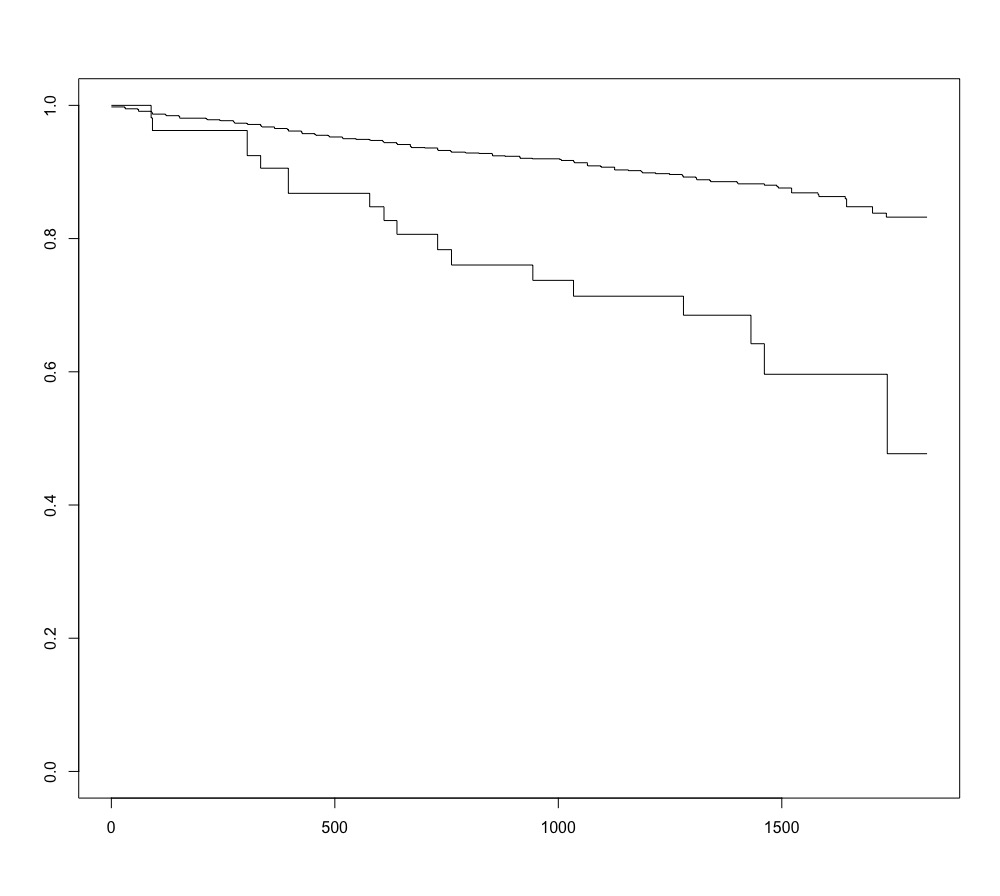
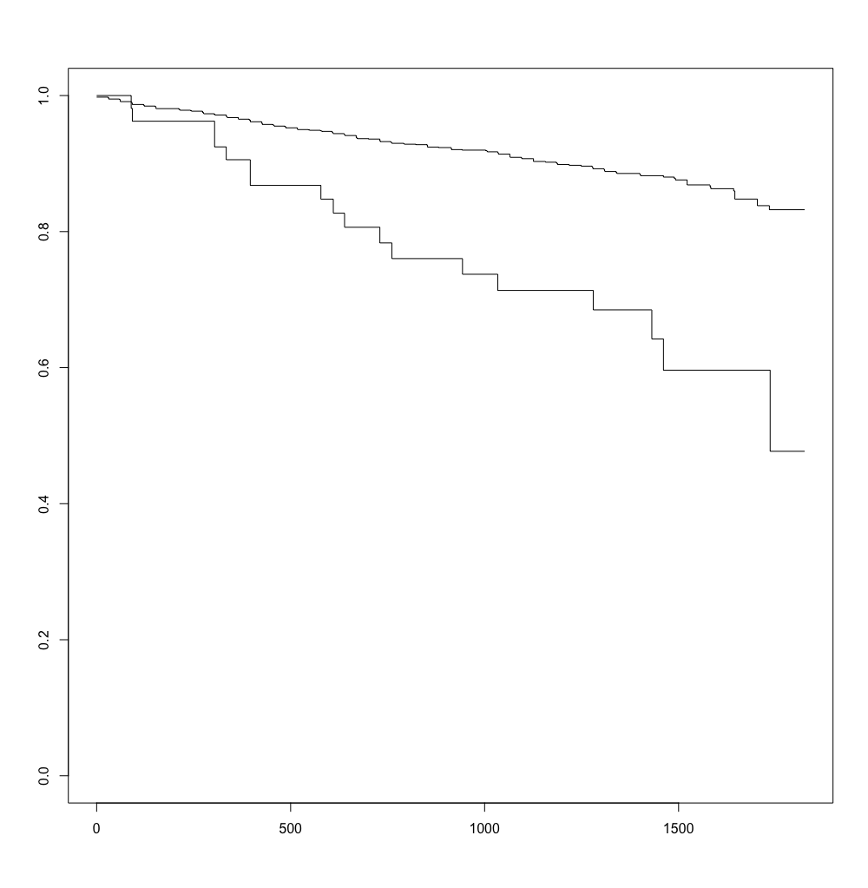

## Population 

 

---

 

## Mortalité précoce chez les patients AVC(+)

- Risque de décès chez le patient ayant présenté un AVC au cours du suivi ;
- Le décés survient, en moyenne, dans le 6 mois qui suivent l'événement. En médiane, dans les 2 mois qui suivent l'événément AVC : certains patients décédent au moment de l'événement.  

|                       | Overall                       | Pas décédé    | Décédé |       |
| :----                 | :-                            | :-        | :-        | :---    |
|                       | N = 53                        | n = 35    | n = 18    | HR [95%CI]    |
| **Modalité de traitement** |                          |           |           | |
| DP                    | 9 (17.0)                      | 2 (11.1)  | 7 (20.0)  | |
| HD                    | 44 (83.0)                     | 16 (88.9) | 28 (80.0) | 1.85 [0.43 ; 8.10]
| **Tabagisme actif**   |                               |           |           | |
| Non                   | 28 (62.2)                     | 10 (66.7) | 18 (60.0) | |
| Oui                   | 17 (37.8)                     | 5 (33.3)  | 12 (40.0) | 0.96 [0.33 ; 2.83]
| **Sexe**              |                               |           |           | |
| Homme                 | 34 (64.2)                     | 14 (77.8) | 20 (57.1) | |
| Femme                 | 19 (35.8)                     | 4 (22.2)  | 15 (42.9) | 0.41 [0.14 ; 1.28]
| **Âge**, moyenne (ET) | 64.27 (11.66)                 | 64.10 (11.35) | 64.36 (11.98) | 0.52 [0.95 ; 1.03] (°)|
| **Traitement**        |                               | 
| Acide salicylique et derivés |1 (2.6)                 | 0 (0.0) | 1 (4.0) |
| Antivitamines K       | 11 (28.2)                     | 3 (21.4) | 8 (32.0) |
| Autres préparations antianemiques | 8 (20.5)          | 5 (35.7) | 3 (12.0) |
| Groupe de l'héparine  | 3 (7.7)                       | 1 (7.1) | 2 (8.0) |
| Inhibiteurs de l'aggregation plaquettaire | 16 (41.0) | 5 (35.7) | 11 (44.0) |
| **Diagnostic** ($)        |                               |
| Accidents ischémiques cérébraux transitoires et syndromes apparentés (G45) | 15 (28.3) | 4 (22.2) | 11 (31.4) |  |
| Hémorragie sous-arachnoïdienne (I60) | 4 (7.5)        | 1 (5.6) | 3 (8.6) |1.28 [0.14 ; 11.6] |
| Hémorragie intracérébrale (I61)| 15 (28.3)            | 8 (44.4) | 7 (20.0) | 2.12 [0.64 ; 7.10] |
| Infarctus cérébral (I63) | 18 (34.0)                  | 5 (27.8) | 13 (37.1) | 1.43 [0.38 ; 5.40]
| Accident vasculaire cérébral, non précisé (I64) | 1 (1.9) | 0 (0.0) | 1 (2.9) | 0.003 [0.00 ; 1.9x10^17] |
| **Antécédents**       |                               |           |           | |
| Non                   | 43 (81.1)                     | 16 (88.9) | 27 (77.1) | |
| Oui                   | 10 (18.9)                     | 2 (11.1) | 8 (22.9) | 0.50 [0.11 ; 2.19] |
| **Causes de décès**   |                               | 
| Inconnue ou pas de décès | 37 ( 69.8)                 | 2 (11.1) | 35 (100.0) |
| I                     | 7 (13.2)                      | 7 (38.9)  | 0 (0.0) | 
| III                   | 1 (1.9)                       | 1 (5.6) | 0 (0.0) |
| V                     | 1 (1.9)                       | 1 (5.6) | 0 (0.0) | 
| VI                    | 7 (13.2)                      | 7 (38.9) | 0 (0.0) |
| **Transplantation** (µ) |                               |          |         |
| Non                   | 40 (75.5)                     | 16 (88.9) | 24 (68.6) | | 
| Oui                   | 13 ( 24.5)                    | 2 (11.1) | 11 (31.4) | 0.58 [0.13 ; 2.56] |
| **Atcd cardiovascularie** |                           |          |           | | 
| Non                   | 26 (53.1)                     | 8 (53.3) | 18 (52.9) | |
| Oui                   | 23 (46.9)                     | 7 (46.7) | 16 (47.1) | 0.74 [0.27 ; 2.10] |
| **Traitement en deux modalités** |                    |          |           | |
| Anti coagulant        | 14 ( 42.4)                    | 4 (36.4) | 10 (45.5) | |
| Anti plaquettaire     |  19 (57.6)                    | 7 (63.6) | 12 (54.5) | 1.25 [ 0.36 ; 4.30] |
| **Diabetes**          |                               |          |           | |
| Non                   | 49 (92.5)                     | 17 (94.4) | 32 (91.4) | |
| Oui                   | 4 (7.5)                       | 1 (5.6) | 3 (8.6) | 0.63 [0.08 ; 4.73] |
| **IMC**               |                               |          |        | |
| <25                   | 28 (62.2)                     | 4 (8.9) | 24 (53.3) | |
| [25-30[               | 11 (24.4)                     | 6 (13.4) | 5 (11.1) |  |
| ≥30                   | 6 (13.4)                      | 3 (6.7) | 3 (6.6) | 5.4 [1.1 ; 22.9] |

(°) variable âge, modèle de Cox : Martingale residuals montrent une non-linéarité \

(µ) variable transplantation, modèle de Cox : proportionnalité des risques non réspectée \

($) variable diagnostic, modèle de Cox : cph du package "rms" car 

## Suivi post-événement

| _(en jours)_      | décédé      | non décédé |
| :-    | :-    | :- |
| moyenne (ET) | 165.9 (242.4) | 676.0 (456.5) |
| médiane [25-75%] | 62.0 [0 - 228.2] | 548 [364-943] |
| min-max | 0-883.2 | 60-1766 |

 

Cette courbe représente l'incidence du décès dans la population ADPKD+ AVC+. \
Le temps de suivi est défini comme : 

- _Patient décédé_ : délai entre AVC et décès ;
- _Patient non-décédé_ : délai entre AVC et fin de l'étude.

 

---

## Mortalité précoce chez les patients AVC(-)

- Risque de décès dans la population n'ayant pas présenté de AVC au cours du suivi. 

|                       | Overall                       | Pas décédé    | Décédé |       |
| :---                 | :--                            | :--        | :--        | :--    |     
|                       | N = 2129                      | n = 1926    | n = 203    | HR [95%CI]    |
| **Modalité de traitement** |                          |             |            | |
| DP                    | 280 (13.2)                    | 255 (13.2)  | 25 (12.3)  | |
| HD                    | 1849 (86.8)                   | 1671 (86.8) | 178 (87.7) | 1. 01 [0.66 ; 1.54] | 
| **Tabagisme actif**   |                               |             |            | |
| Non                   | 1149 (62.3)                   | 1049 (62.3) | 100 (62.1)  | |
| Oui                   | 696 (37.7)                    | 635 (37.7)  | 61 (37.9)  | 1.04 [0.73 ; 1.42] |
| **Sexe**              |                               |             |            | | 
| Homme                 | 1110 (52.1)                   | 995 (51.7)  | 115 (56.7) | |
| Femme                 | 1019 (47.9)                   | 931 (48.3)  | 88 (43.3) | 0.81 [0.61 ; 1.07] |   
| **Age**, moyenne (ET) | 59.49 (12.84)                 | 58.04 (12.03) | 73.25 (12.08) | 1.10 [1.10 ; 1.11] |
| **Traitement**        |                               |             |            | |
| Acide salicylique et derivés | 36 (2.5)               | 36 (2.7)    | 0 (0.0)    | |
| Antifibrinolytiques   | 10 (0.7)                      | 9 (0.7)     | 1 (0.7)    | |
| Antivitamines K       | 206 (14.2)                    | 169 (12.9)  | 34 (24.6)  | |
| Autres antithrombotiques | 4 (0.3)                    | 4 (0.3)     | 0 (0.0)    | |
| Autres hemostatiques systemiques | 1 (0.1)            | 1 (0.1)     | 0 (0.0)    | |
| Autres preparations antianemiques | 460 (31.7)        | 426 (32.5)  | 34 (24.6)  | | 
| Groupe de l'héparine | 283 (19.5)                     | 272 (20.7)  | 11 (8.0)   | |
| Inhibiteurs directs du facteur Xa | 2 (0.1)           | 2 (0.2)     | 0 (0.0)    | |
| Inhibiteurs de l'agregation plaquettaire, héparine exclue | 447 (30.8) | 392 (29.9) | 55 (40.1) | |
| Vitamine K | 1 (0.1)                                  | 1 (0.1)     | 0 (0.0)    | |
| **Antécédents** |                                     |             |            | |        
| Non             | 1984 (93.2)                         | 1797 (93.3) | 187 (92.1) | |                                                   
| Oui             | 145 (6.8)                           | 129 (6.7)   | 16 (7.9)   | 1.20 [0.71 ; 1.96] | 
| **Causes de décès** |                                 |             |            | |
| Inconnue ou pas de décès |1939 (91.1)                 | 1926 (100.0)| 13 (6.4)   | |
| I               | 39 (1.8)                            | 0 (0.0)     | 39 (19.3)  | |
| III             | 21 (1.0)                            | 0 (0.0)     | 21 (10.4)  | |
| V               | 31 (1.5)                            | 0 (0.0)     | 31 (15.3)  | |
| VI              | 99 (4.7)                            | 0 (0.0)     | 99 (48.8)  | |
| **Transplantation**  |                                |             |            | |
| Non             | 1239 (58.2)                         | 1055 (54.8) | 184 (90.6) | |
| Oui             | 880 (41.8)                          | 871 (45.2)  | 19 (9.4)   | 0.10 [0.07 ; 0.17] | 
| **Antécédents cardiovasculaires** |                   |             |            | |
| Non             | 1501 (73.8)                         | 1409 (76.5) | 92 (48.6)  | |
| Oui             | 532 (26.2)                          | 871 (45.2)  | 19 (9.4)   | 3.20 [2.38 ; 4.22] |
| **Traitement en deux modalités** |                    |             |            | |
| Anticoagulant   | 519 (51.0)                          | 465 (23.6)  | 97 (51.3)  | |
| Antiplaquettaire| 498 (49.0)                          | 441 (48.7)  | 57 (51.8)  | 1.14 [0.80 ; 1.65] |
| **Diabetes**     |                                    |             |            | |
| Non             | 1926 (90.8)                         | 1751 (91.4) | 172 (84.7) | |
| Oui             | 196 (9.2)                           | 165 (8.6)   | 31 (15.3)  | 1.83 [1.25 ; 2.68] |
| **IMC**         |                                     |             |            | |                               
| <25             | 909 (47.9)                          | 811 (47.3)  | 98 (53.3)  | |
| [25-30[         | 641 (33.8)                          | 574 (33.5)  | 67 (36.2)  | 0.98 [0.71 ; 1.33] |
| ≥30             | 348 (18.3)                         | 328 (19.1)  | 20 (10.8)  | 0.50 [0.31 ; 0.82] |

 

-----

 

## Décès et AVC

- Association etre caractéristiques de la population et AVC chez la population décédée 
- Suivi moyen (et médian) des patients AVC(+) et AVC(-)
- Estimateur de Kaplan-Meier pour le décès patients AVC(+) *vs* patients AVC(-)

|                       | Overall                       | AVC(-)    | AVC(+)   |       |
| :------                 | :-                            | :-        | :-        | -:    |
|                       | N = 221                       | n = 203    | n = 18    | _p-value_ (*)    |
| **Modalité de traitement** |                          |           |           | _0.99_|
| DP                    | 27 (12.2) | 25 (12.3) | 2 (11.1)| |
| HD                    | 194 (87.8) | 178 (87.7) | 16 (88.9) |  |
| **Tabagisme actif**   |                               |           |           | _0.7911_ |
| Non                   | 110 (62.5) | 100 (62.1) | 10 (66.7) | |
| Oui                   | 66 (37.5) | 88 (43.3) | 5 (33.3) | |
| **Sexe**              |                               |           |           | _0.1292_ |
| Homme                 | 129 (58.4) | 115 (56.7) | 14 (77.8) | |
| Femme                 | 66 (37.5) | 88 (43.3)  | 4 (22.2) | |
| **Âge**, moyenne (ET) | 72.5 (12.3) | 73.6 (12.1) | 64.1 (11.4) | _<0.001_ |
| **Traitement**        |           | 
| Antifibrinolytiques | 1 (0.7) | 1 (0.7) | 0 (0.0) | |
| Antivitamines K       | 40 (26.3) | 37 (26.6) | 3 (21.4) | |
| Autres préparations antianemiques | 39 (25.7) | 34 (24.6) | 5 (35.7) | |
| Groupe de l'héparine  | 12 (7.9) | 11 (8.0) | 1 (7.1) | |
| Inhibiteurs de l'aggregation plaquettaire | 60 (39.5) | 55 (39.9) | 5 (35.7) |        | 
| **Diagnostic** | | | | _<0.001_ | 
| Aucun diagnostic | 202 (91.4) | 202 (99.5) | 0 (0.0) | |
| Accidents ischémiques cérébraux transitoires et syndromes apparentés (G45) | 4 (1.8) | 0 (0.0) | 4 (22.2) |  |
| Hémorragie sous-arachnoïdienne (I60) | 1 (0.5)| 0 (0.0) | 1 (5.6) | |
| Hémorragie intracérébrale (I61)| 8 (3.6) | 0 (0.0) | 8 (44.4) | |
| Infarctus cérébral (I63) | 6 (2.7) | 1 (0.5) | 5 (27.8) |  |
| **Antécédents**       |                               |           |           | _0.6538_ |
| Non                   | 203 (91.6) | 187 (92.1) | 16 (88.9) | |
| Oui                   | 18 (8.1) | 16 (7.9) | 2 (11.1) | |
| **Causes de décès**   |           |         |           | _0.232_ | 
| Inconnue ou pas de décès | 15 (6.8) | 13 (6.4) | 2 (11.1) |
| I                     | 46 (20.8) | 39 (19.2) | 7 (38.9) | 
| III                   | 32 (14.5) | 21 (10.3) | 7 (38.9) |
| V                     | 32 (14.5) | 31 (15.3) | 1 (5.6) | 
| VI                    | 106 (48.8) | 99 (48.8) | 7 (38.9) |
| **Transplantation** |                               |          |   _0.99_      |
| Non                   | 200 (90.5) | 184 (90.6) | 16 (88.9) | | 
| Oui                   | 21 (9.5) | 19 (9.4) | 7 (38.9) | |
| **Atcd cardiovascularie** |                           |          |           | _0.7943_ | 
| Non                   | 100 (48.8) | 92 (48.4) | 8 (53.3) | |
| Oui                   | 21 (9.5)| 98 (51.6) | 7 (46.7) | |
| **Traitement en deux modalités** |                    |          |           | _0.531_ |
| Anti coagulant        | 58 (47.5)  | 54 (48.6) | 4 (36.4) | |
| Anti plaquettaire     | 64 (52.5) | 57 (51.4) | 7 (63.6) | |
| **Diabetes**          |                               |          |           | _0.3248_ |
| Non                   | 189 (85.5) | 172 (84.7) | 17 (94.4) | |
| Oui                   | 32 (14.5) | 31 (15.3) | 1 (5.6) |  |
| **IMC**               |                               |          |        | _0.1977_ |
| <25                   | 102 (51.5) | 98 (53.0) | 4 (30.8) | |
| [25-30[               | 73 (36.9) | 67 (36.2) | 6 (46.2) | |
| ≥30                   | 23 (11.6) | 20 (10.8) | 3 (23.1) | |

(*) p-value = chi-squared with p-value simulation or Student test

 

---

 

## Décès en fonction de l'événement (AVC ischémique ou hémorragique)

HR [95%CI] = 3.41 [2.11 ; 5.52]

|  | moyenne (ET) | médiane |
| :-     | :-:           | :-:      |
| **AVC(-)** | 1041 (437)   | 1035    |
| **AVC(+)** | 1075 (506)   | 1186    |

---

## Décès 

* Risque instantanée de décès en fonction des caractéristiques de la population ADPKD+

|                       | Overall                         | DECES(-)    | DECES(+)   |       |
| :----                 | :--                            | :--          | :--         | :-----    |
|                       | N = 2 182                       | n = 1961    | n = 221     | HR [95%CI]  |
| **Modalité de traitement** |                            |             |            | |         
| DP                    | 289 (13.2)                      | 262 (13.4)  | 27 (12.2) | |
| HD                    | 1 893 (86.8)                    | 1 699 (86.6)| 194 (87.8) | 1.04 [0.79 ; 1.56] |
| **Tabagisme actif**   |                                 |             |             | |      
| Non                   | 1 177 (62.3)                    | 1 067 (62.3) | 110 (62.5) | |
| Oui                   | 713 (37.3)                      | 647 (37.7) | 66 (37.5) | 1.02 [0.75 ; 1.39] |
| **Sexe**              |                                 |             |             | |
| Homme                 | 1 144 (52.4)                    | 1 015 (51.8) | 129 (58.4) | |
| Femme                 | 1 038                           | 946 (48.2) | 92 (41.6) | 0.76 [0.58 ; 0.99] |
| **Âge**, moyenne (ET) | 59.6 (12.8)                    | 58.2 (12.1) | 72.5 (12.3) | 1.09 [1.08 ; 1.10] |
| **Traitement**            |                                 |             |             |   
| Acide salycilique et derivés | 37 (2.5)                 | 37 (2.8) | 0 (0.0) | |
| Antifibrinolytiques | 10 (0.7)                          | 9 (0.7) | 1 (0.7) | |
| Antivitamines K | 217 (14.6)                            | 177 (13.2) | 40 (26.3) | |
| Autres hémostatiques systémiques | 1 (0.1)              | 4 (0.3) | 0 (0.0) | |
| Autres préparations antianemiques | 468 (31.4)          | 1 (0.1) | 0 (0.0) | |
| Groupe de l'héparine | 286 (19.2)                       | 429 (32.1) | 39 (25.7) | |
| Inhibiteurs directs du facteurs Xa | 2 (0.1)            | 274 (20.5) | 12 (7.9) | | 
| Inhibiteurs de l'aggrégation plaquettaire, héparine exclue | 463 (31.1) | 403 (30.1) | 60 (39.5) | |
| Vitamine K | 1 (0.1)                                    | 1 (0.1) | 0 (0.0) | |
| **Diagnostic**        |                                 |             |              |
| Aucun diagnostic      | 2 125 (97.4)                    | 1 923 (98.1) | 202 (91.4) | |
| Accidents ischémiques cérébraux transitoires et syndromes apparentés (G45) | 16 (0.7) | 12 (0.6) | 4 (1.8) | |
| Hémorragie sous-arachnoïienne (I60) | 4 (0.2)           | 3 (0.2) | 1 (0.5) | |
| Hémorragie intracérébrale (I61) | 16 (0.7)              | 8 (0.4) | 8 (3.6) | |
| Infarctus intracérébral | 20 (0.9)                      | 14 (0.7) | 6 (2.7) | |
| Accident vasculaire cérébral non précisé | 1 (0.0)      | 1 (0.1) | 0 (0.0) | |
| **Diagnostic en deux modalités** |                      |         |         | |
| Pas d'évènement | 
| AVC (ischémique ou hémorragique) |
| **Antécédents**       |                                 |             |               | |
| Non                   | 2 027 (92.9)                    | 1 824 (93.0) | 202 (91.4) | |
| Oui                   | 155 (7.1)                       | 12 (0.6) | 4 (1.8) | 1.17 [0.73 ; 1.90] |
| **Causes de décès**   |                                 |             |               |           | 
| Inconnue ou pas de décès | 1 976 (90.6)                 | 1 961 (100.0) | 15 (6.8) | |
| I                     | 46 (2.1)                        | 0 (0.0) | 46 (20.8) | |
| III                   | 22 (1.0)                        | 0 (0.0) | 22 (10.0) | |
| V                     | 32 (1.5)                        | 0 (0.0) | 32 (14.5) | |
| VI                    | 106 (4.9)                       | 0 (0.0) | 106 (48.0) | |
| **Transplantation**   |                                 |             |               | |          
| Non                   | 1 279 (58.6)                    | 1 079 (55.0) | 200 (90.5) | |
| Oui                   | 903 (41.4)                      | 882 (45.0) | 21 (9.5) | 0.11 [0.07 ; 0.17] |
| **Atcd cardiovasculaire** |                             |             |                | |
| Non                   | 1 527 (73.3)                    | 1 427 (76.0) | 200 (90.5) | |
| Oui                   | 555 (26.7)                      | 450 (24.0) | 105 (51.2) | 3.05 [2.32 ; 3.01] |
| **Traitement en deux modalités**    |                   |             |                 | |
| Anticoagulant         | 544 (50.8)                      | 475 (51.2) | 105 (51.2) | |
| Antiplaquettaire      | 517 (49.2)                      | 453 (48.8) | 64 (52.5) | 1.17 [0.82 ; 1.67] |
| **Diabetes**          |                                 |             |                 | |
| Non                   | 1 972 (90.8)                    | 1 786 (91.4) | 189 (85.5) | |
| Oui                   | 200 (9.2)                       | 168 (8.6) | 32 (14.5) | 1.73 [1.20 ; 2.52] |
| **IMC**               |                                 |             |                | |
| <25                   | 937 (48.2)                      | 835 (47.9) | 102 (51.5) | |
| [25-30[               | 652 (33.6)                      | 579 (33.2) | 73 (36.9) | 1.05 [0.77 ; 1.42] |
| ≥30                   | 354 (18.2)                      | 331 (19.0) | 23 (11.6) | 0.59 [0.38 ; 0.94] |

