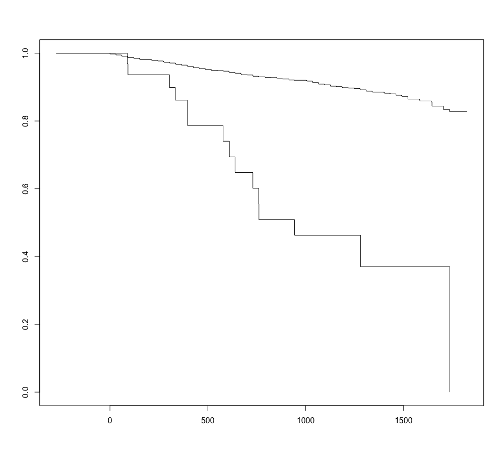
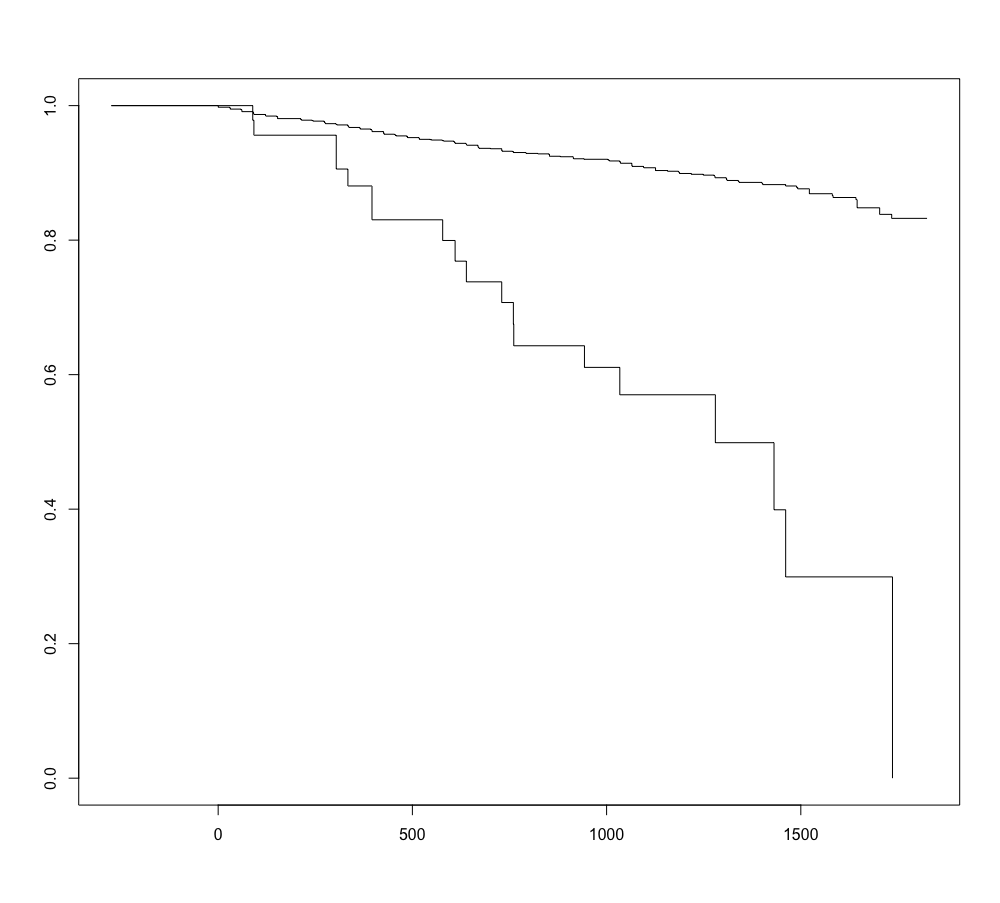

## Analysis 1 (G45 excl)

<br>

### Variable âge

| min | 1st qu. | median | mean | sd | 3rd qu. | max |
| :-: | :-:     | :-:    | :-:  | :-:| :-:     | :-: |
| 18.64 | 49.80 | 58.02 | 59.61 | 12.83 | 68.73 | 96.34 |

##### Distribution en fonction de l'événement 

| | No event | Event | 
| :--- | :--- | :--- | 
| Mean | 59.56 | 61.71 | 
| SD | 12.83 | 12.19 | 
| Median | 57.93 | 61.00 | 
| Min | 18.64 | 37.62 | 
| Max | 96.34 | 82.76 | 

##### Variable _âge_ en deux modalités
```
adpkd$age2 = if_else(adpkd$age <= 58.02, "1", "2")
```

<br>

---

<br>

### Variable diagnostic 

| Type d'événement | n (%) | CIM-10 | _Modalité_ | 
| :---             | :--   | :-     | -:         |
| Ischémique       | 20 (1)   | I63    | _1 (réf)_  |
| Hémorragique     | 20 (1)   | I60 + I61 | _2_     |
| Aucun événement  | 2141 (98) | -        | _3_     |

Exclus de cette analyse :

* _G45_, AIT
* _G46_, syndromes vasculaires 
* _G81_, hémiplégie 
* _I64_, ischémique ou hémorragique non spécifié

<br>

---

<br>

#### Analyse descriptive

| |              |
| :--- | :- |
|  | N 2182 |
| **Type de dialyse** | |
| DP | 289 (13.2) | 
| HD | 1893 (86.8) | 
| **Tabagisme** | | 
| Non | 1177 (62.3) | 
| Oui | 713 (37.7) | 
| **Sexe** | |
| Homme | 1144 (52.4) | 
| Femme | 1038 (47.6) |
| **Age** | | 
| ≤ 58 | 1091 (50.0) | 
| > 58 | 1091 (50.0) | 
| **Diagnostic** | | 
| Ischémie (I63) | 20 (0.9) |
| Hémorragie (I60 et 161) | 20 (0.9) | 
| Aucun événement | 2141 (98.2) |
| **Antécédents AVC** | | 
| Non | 2027 (92.9) | 
| Oui | 155 (7.1) | 
| **Décès** | |
| Pas décédé ou DM | 1976 (90.6) | 
| I | 46 (2.1) |
| III | 22 (1.0) | 
| V | 32 (1.5) | 
| VI | 106 (4.9) | 
| **Transplantation** | |
| Non | 1279 (58.6) | 
| Oui | 903 (41.4) | 
| **Antécédent cardiovasculaire** | |
| Non | 1527 (73.3) | 
| Oui | 555 (26.7) | 
| **Traitement médicamenteux** | |
| Anticoagulant| 532 (50.7) |
| Antiplaquettaire | 517 (49.3) |
| **Diabetes** | |
| Non | 1975 (90.8) |
| Oui | 200 (9.2) | 
| **IMC** | |
| < 25 | 937 (48.2) | 
| [25-30[ | 652 (33.6) | 
| ≥ 30 | 354 (18.2) |
| **Décès** | |
| Non | 1961 (89.9) |
| Oui | 221 (10.1) | 

### Analyse univariée 

|               |   No AVC | AVC | HR [95%CI] | _p-value_ |
| :--- | :-- | :-- | :-- | :-- |
| | (n = 2141) | (n = 40) |  | |
| **Type de dialyse** | | | | _0.98_ |
| DP | 283 (13.2) | 5 (12.5) | _ref._ | |
| HD |  1858 (86.8) | 35 (87.5) | 1.01 [0.39; 2.78] | |
| **Tabagisme** | | | | _0.76_ |
| Non | 1155 (62.2) | 21 (65.6) | _ref._ | |
| Oui | 702 (37.8) | 11 (34.4) | 0.89 [0.43; 1.84] | |
| **Sexe** | | | | _0.04_ |
| Homme | 1117 (52.2) | 27 (67.5) | _ref._ | |
| Femme | 1024 (47.8) | 13 (32.5) | 0.51 [0.26; 0.99] | |
| **Age** | | | | _0.09_ |
| ≤ 58 | 1075 (50.2) | 16 (40.0) | _ref._ | |
| > 58 | 1066 (49.8) | 24 (60.0) | 1.60 [0.85; 3.02] | |
| **Diagnostic** | | | | |
| Ischémie (I63) | 0 (0.0) | 20 (50.0) | | |
| Hémorragie (I60 et 161) |0 (0.0) | 20 (50.0) | | | 
| Aucun événement | 2141 (100.0) | 0 (0.0) | | | 
| **Antécédents AVC** | | | | _<0.001_ | 
| Non | 1996 (93.2) | 30 (75.0) | _ref._ | |
| Oui | 145 (6.8) | 10 (25.0) | 4.59 [2.24; 9.39] | |
| **Décès** | | | | | 
| Pas décédé ou DM | 1947 (90.9) | 28 (70.0) | | | 
| I | 40 (1.9) |  6 (15.0) | | |
| III | 21 (1.0) | 1 (2.5) | | |
| V | 31 (1.4) | 1 (2.5)  | | |
| VI | 102 (4.8) | 4 (10.0) | | |
| **Transplantation** | | | | _0.010_ | 
| Non | 1249 (58.3) | 29 (72.5) | _ref._ | |
| Oui | 892 (41.7) | 11 (27.5) | 0.39 [0.20; 0.80] | | 
| **Antécédent cardiovasculaire** | | | | _<0.001_ |
| Non | 1509 (73.8) |  18 (48.6)  | _ref._ | |
| Oui | 535 (26.2) | 19 (51.4) | 3.08 [1.61; 5.86] | |
| **Traitement médicamenteux** | | | | _0.82_ | 
| Anticoagulant| 517 (50.6) | 15 (53.6) | _ref._ | |
| Antiplaquettaire | 504 (49.4) | 13 (46.4) | 0.92 [0.44; 1.94] | |
| **Diabetes** |  | | | _0.77_ |
| Non | 1937 (90.8) |  37 (92.5)  | _ref._ | |
| Oui | 504 (49.4) | 13 (46.4)  | 0.83 [0.26; 2.71] | |
| **IMC** | | | |  |
| < 25 | 918 (48.1) | 18 (54.5) | _ref._ | |
| [25-30[ | 643 (33.7) | 9 (27.3) | 0.72 [0.33; 1.62] | _0.44_ |
| ≥ 30 | 348 (18.2) | 6 (18.2) | 0.89 [0.35; 2.23] | _0.79_ |
| **Décès** (*) | | | | 
| Non | 1935 (90.4) | 25 (62.5) |
| Oui | 206 (9.6) | 15 (37.5)  |

<br>

---

<br>

#### Décès et AVC (*)
Pearson's Chi-squared test with simulated p-value (based on 10000 replicates)\
_p-value = <0.001_ \
\
**Conclusion** : le décès est plus fréquent chez les patients ayant eu un AVC. \

<br>


|     | Death (-) | Death (+)  | HR [95%CI] | _p-value_ |
| :-- | :-- | :-- |  :-- | --: |
|     |     |     |      | _0.677_  |
| Ischémie (I63) | 14 (0.7) | 6 (2.7) | _ref._ | |
| Hémorragie (I60 et I61) | 11 (0.6) | 9 (4.1) | 1.36 [0.58; 3.83] | |
| Aucun | 1935 (98.7) | 206 (93.2) | 0.99 [0.44; 2.24] | |
| _DM_ | _1_ | _0_ | | |

<br>

##### Time (days) to death by event 

|        | mean          |   sd | median | min   | max |
| :--     | :---:        | :---:    | :---:    | :---:    | :---: |
| No AVC | 1298 | 273 | 1339 | 425 | 1825 |
| AVC | 1247  | 357 | 1186 | 698 | 1794 |  

<br>



---

## Analyis 2 (G45 incl) 

<br>

### Variable diagnostic 

| Type d'événement | n (%) | CIM-10 | _Modalité_ | 
| :---             | :--   | :-     | -:         |
| Ischémique ou AIT      | 36 (1.7)   | I63 + G45   | _1 (réf)_  |
| Hémorragique     | 20 (0.9)   | I60 + I61 | _2_     |
| Aucun événement  | 2141 (97.4) | -        | _3_     |

Exclus de cette analyse :

* _G46_, syndromes vasculaires 
* _G81_, hémiplégie 
* _I64_, ischémique ou hémorragique non spécifié

<br>

---

<br>

### Analyse univariée 

|      |   No AVC | AVC | HR [95%CI] | _p-value_ |
| :--- | :-- | :-- | :-- | :-- |
|                 | (n = 2125) |  (n = 56)  |     |     |        
| **Traitement** |             |              |     | _0.43_  |
| DP           | 279 (13.1)  | 9 (16.1)     | _ref._ | |     
| HD          |   1846 (86.9) | 47 (83.9)   | 0.75 [0.37; 1.53]     | |     
| **Tabagisme** |             |               |     | _0.91_ |
| Non | 1146 (62.2) | 30 (63.8) | _ref._ | |     
| Oui | 696 (37.8)  | 17 (36.2) | 0.97 [0.53; 1.76] | |   
| **Sexe** |                |               |       | _0.10_ |
| Homme | 1109 (52.2) | 35 (62.5) | _ref._ |    |       
| Femme | 1016 (47.8) | 21 (37.5) | 0.63 [0.37; 1.09]      |     |     
| **Age** |                 |               |       | _0.008_ |
| ≤58 |   1072 (50.4) | 19 (33.9) | _ref._    | |   
| >58 | 1053 (49.6) | 37 (66.1) | 2.10 [1.21; 3.65]        |   |
| Diagnostic    |           |           |     |  |
| Ischémie (I63) ou AIT (G45) |0 (0.0) | 36 (64.3) | | |   
| Hémorragie (I60 et I61) | 0 (0.0) | 20 (35.7) | | |      
| Aucun événement | 2125 (100.0) | 0 (0.0) | | |      
| **Antécédentes AVC** |            |           |   | _<0.001_ |
| Non | 1981 (93.2) | 45 (80.4) | _ref._ | |        
| Oui | 144 (6.8) | 11 (19.6) | 3.37 [1.74; 6.52] | |
| **Décès |           |       |         |     | 
| Pas décès ou DM | 1935 (91.1) | 40 (71.4) | |     
| I | 39 (1.8) |7 (12.5) |    | |  
| III | 21 (1.0)      |   1 (1.8)     |   | |
| V  |   31 (1.5)      |   1 (1.8)     |    ||
|  VI |   99 (4.7)    |     7 (12.5)    | | |    
| **Transplantation** |       |     |   | _0.005_ |
| Non | 1239 (58.3) | 39 (69.6) | _ref._ | |
| Oui | 886 (41.7) | 17 (30.4) | 0.44 [0.28; 0.79] | |      
| **Antécédents cardiovasculaires** |     |     | | _<0.001_ |
| Non | 1500 (73.9) | 27 (51.9) | _ref._ | |      
| Oui | 529 (26.1)  | 25 (48.1)  | 2.73 [1.58; 4.70] | |      
| **Traitement médicamenteux**    | | | | _0.61_ |
| Anticoagulant | 515 (50.8) | 17 (47.2) | _ref._ | |    
| Antiplaquettaire | 498 (49.2) | 19 (52.8) | 1.19 [0.62; 2.23] | |     
| **Diabetes** |    |     |   | _0.65_ |
| Non | 1922 (90.7) 52 (92.9) | _ref._ | |       
| Oui | 196 (9.3) | 4 (7.1) | 0.79 [0.23; 2.18] | |      
**IMC** |   |   |     | |
| <25 | 907 (47.9) | 29 (61.7) | _ref._ |     |  
| [25-30[ | 641 (33.8) |  11 (23.4) | 0.54 [0.27; 1.01] | _0.09_ |       
| ≥ 30 | 347 (18.3) | 7 (14.9) | 0.63 [0.28; 1.45] | _0.29_ |       
| **Décès** (*) |   |     |     |  |
| Non | 1923 (90.5) | 37 (66.1)  | _ref._ |   |     
| Oui | 202 (9.5) | 19 (33.9) | HR | |   

<br>

---

<br>

#### Décès et AVC (*)
Pearson's Chi-squared test with simulated p-value (based on 10000 replicates)\
_p-value = <0.001_ \
\
**Conclusion** : le décès est plus fréquent chez les patients ayant eu un AVC. \

<br>


|     | Death (-) | Death (+)  | HR [95%CI] | _p-value_ |
| :-- | :-- | :-- |  :-- | --: |
|     |     |     |      | _0.543_ |
| Ischémie ou AIT (I63 ou G45) |  26  | 10  | _ref._ | |
| Hémorragie (I60 et I61) |  11 |   9 |  1.68 [0.68; 4.15] | | 
| Aucun |   1923  | 202 | 1.23 [0.65; 2.34] | |
| _DM_ |  _1_ | _0_ | | | 

<br>

##### Time (days) to death by event 

|        | mean          |   sd | median | min   | max |
| :--     | :---:        | :---:    | :---:    | :---:    | :---: |
| No AVC | 1296 | 374 | 1339 | 425 | 1825 |
| AVC | 1275  | 353 | 1247 | 698 | 1825 | 

<br>


